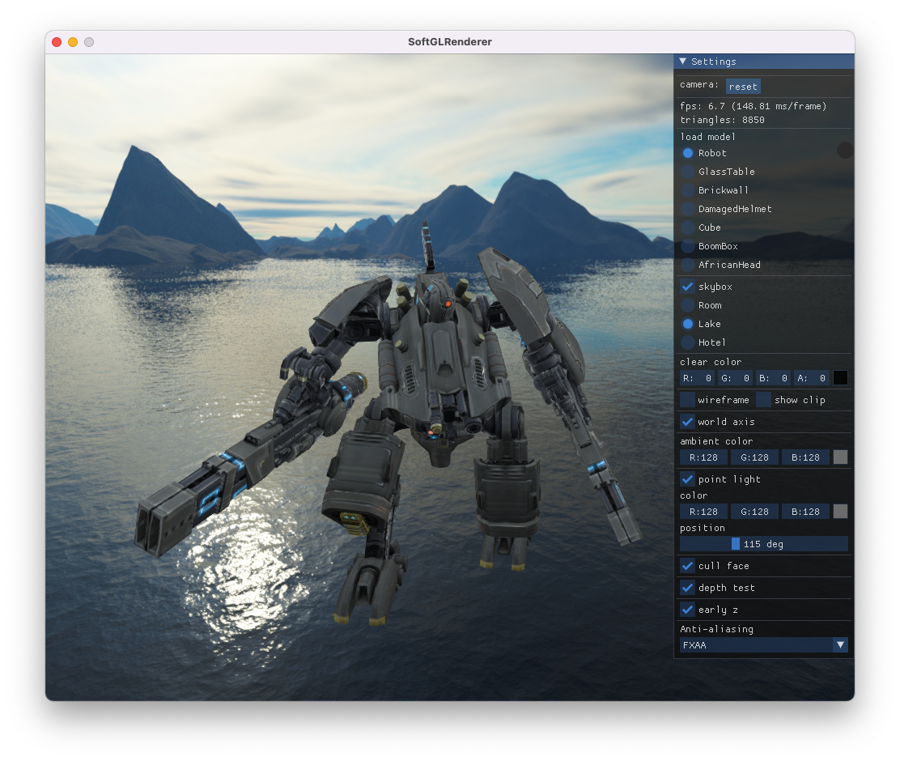

# SoftGLRender
Tiny C++ Software Renderer/Rasterizer, it implements the main GPU rendering pipeline, 3D models (GLTF) are loaded by [assimp](https://github.com/assimp/assimp), and using [GLM](https://github.com/g-truc/glm) as math library.

<div align="center">

[](./LICENSE)

[](https://github.com/keith2018/SoftGLRender/actions/workflows/cmake_macos.yml)
[](https://github.com/keith2018/SoftGLRender/actions/workflows/cmake_windows.yml)
[](https://github.com/keith2018/SoftGLRender/actions/workflows/cmake_linux.yml)

</div>


#### Code structure:

- [renderer](src/renderer): the main software renderer implementation, first preparing input data (Vertexes, Indices), then binding custom shaders, and setup rendering pipeline, after the pipeline finished, graphics will draw to the result framebuffer.
- [shader](src/shader): the programmable render pipeline simulation, vertex shader and fragment shader are supported, and it is easy to port real GLSL code to this project, several basic shaders are embed such as blinn-phong lighting, skybox, PBR & IBL, etc.
- [app](src/app): code for Viewer, mainly include GLTF loading (based on Assimp), camera & controller, setting panel, and render pass management.

#### Renderer Pipeline Features

- Wireframe
- View Frustum culling
- Back-Front culling
- Orbit Camera Controller
- Perspective Correct Interpolation
- Tangent Space Normal Mapping
- Basic Lighting
- Blinn-Phong shading
- PBR & IBL shading
- Skybox CubeMap & Equirectangular
- Texture mipmaps
- Texture tiling and swizzling (linear, tiled, morton)
- Texture filtering and wrapping
- Shader varying partial derivative `dFdx` `dFdy`
- Alpha mask & blend
- Reversed Z, Early Z

#### Texture

Texture Filtering
  - NEAREST
  - LINEAR
  - NEAREST_MIPMAP_NEAREST
  - LINEAR_MIPMAP_NEAREST
  - NEAREST_MIPMAP_LINEAR
  - LINEAR_MIPMAP_LINEAR

Texture Wrapping
  - REPEAT
  - MIRRORED_REPEAT
  - CLAMP_TO_EDGE
  - CLAMP_TO_BORDER
  - CLAMP_TO_ZERO

Several commonly used texture fetch parameter are Supported, such as `Lod`, `Bias`, `Offset`, to support texture mipmaps, the renderer pipeline has implement shader varying partial derivative function `dFdx` `dFdy`, rasterization operates on 4 pixels as a Quad, `dFdx` `dFdy` is the difference between adjacent pixel shader variables:

```cpp
/**
 *   p2--p3
 *   |   |
 *   p0--p1
 */
PixelContext pixels[4];
```

The storage of texture supports three modes:

- Linear: pixel values are stored line by line, commonly used as image RGBA buffer
- Tiled: block base storage, inside the block pixels are stored as `Linear`
- Morton: block base storage, inside the block pixels are stored as morton pattern (similar to zigzag)

#### Anti Aliasing

- [x] SSAA
- [x] FXAA
- [ ] MSAA
- [ ] TAA

#### Shading

- [x] Blinn-Phong
- [x] PBR-BRDF

#### Optimization
- Multi-Threading: rasterization is block based with multi-threading support, currently the triangle traversal algorithm needs to be optimized.
- SIMD: SIMD acceleration is used to optimize performance bottlenecks, such as barycentric coordinate calculation, shader's varying interpolation, etc.

## Showcase
### Render Textured

- BoomBox (PBR)
  

- Robot
  
  
- DamagedHelmet (PBR)
  

- GlassTable
  

- AfricanHead
  

- Brickwall
  

- Cube
  


### Render Wireframe

Check "show clip" to show the triangles created by frustum clip


## Dependencies
* [GLM](https://github.com/g-truc/glm)
* [json11](https://github.com/dropbox/json11)
* [stb_image](https://github.com/nothings/stb)
* [assimp](https://github.com/assimp/assimp)
* [imgui](https://github.com/ocornut/imgui)


## Clone
```bash
git clone git@github.com:keith2018/SoftGLRender.git
cd SoftGLRender
git submodule update --init --recursive
```

## Build

```bash
mkdir build
cmake -B ./build -DCMAKE_BUILD_TYPE=Release
cmake --build ./build --config Release
```

## Run

```bash
cd bin/Release
./SoftGLRender
```

## License
This code is licensed under the MIT License (see [LICENSE](LICENSE)).
